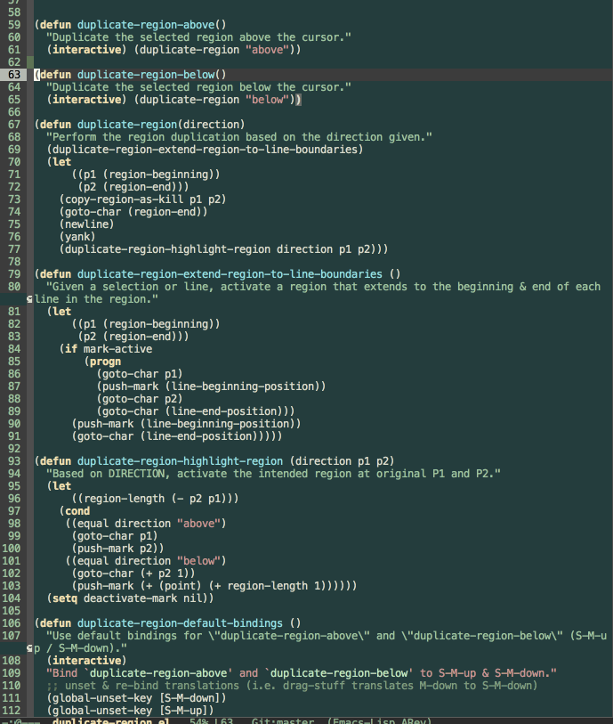

# DuplicateRegion (1.0.0)

### DuplicateRegion

Allows you to duplicate an activated region of text, above or below.

If no region is currently activated, it will duplicate your current
line above or below.

In the style of other editors like Visual Studio Code, this feature will eagerly
assume that you want to duplicate entire lines, regardless of the
location of the cursor/region.

### Notes

Caveat: automatic activation of the duplicated region is a feature that exists
only for parity with other editors, and feels awkward to me in Emacs.

This is due to the behavior of `undo` in Transient Mark Mode (which is
usually on by default). In Transient Mark Mode, `undo` operates only
on changes within the selected region.

Ergo, if you perform a duplication accidentally, `undo` won't
get rid of it unless you deactivate the region first. This feels
unintuitive because I'd prefer easily undoing the action to easily
deleting it. Jury is out on whether it should be kept, removed, or maybe
put behind a flag or separate interactive function.

### Demonstration

